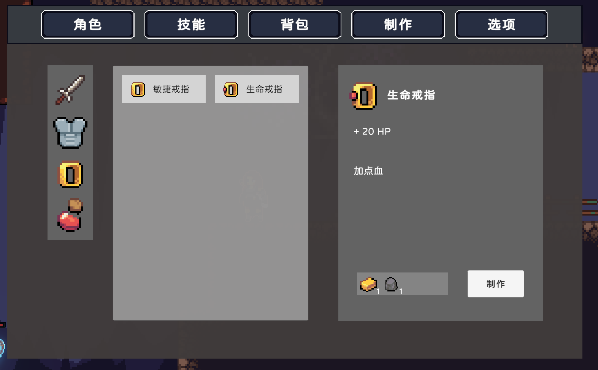

# Reach Out

Unity 2D 类银河恶魔城ARPG demo 

<!-- PROJECT LOGO -->
 

    
  

  <h3 align="center">名字是在做进入游戏的时候随机到的歌名</h3>
  

     
    <a href="https://github.com/SakuyurIXXX/rpg_demo1/"><strong>探索本项目的文档 »</strong></a>
     
     
    <a href="https://github.com/SakuyurIXXX/rpg_demo1">查看Demo</a>
    ·
    <a href="https://github.com/SakuyurIXXX/rpg_demo1/issues">报告Bug</a>
    ·
    <a href="https://github.com/SakuyurIXXX/rpg_demo1/issues">提出新特性</a>
  

 
## 目录

- [战斗系统](#战斗系统)
- [背包/合成系统](#背包/合成系统)
- [技能系统](#技能系统)
- [地图内容](#地图内容)
- [贡献者](#贡献者)
  - [如何参与开源项目](#如何参与开源项目)
- [版本控制](#版本控制)
- [作者](#作者)
- [鸣谢](#鸣谢)

### 战斗系统

传统RPG系统，攻击方面拥有三种属性伤害（火、冰、雷）和可造成暴击的物理伤害，其中属性伤害能造成对应的属性异常效果，获取counter技能后可弹反敌人的一些招式。防御方面有护甲值、法抗、HP值、闪避以及可获得的格挡技能和冲刺技能

  
  
  

  

### 背包/合成系统

击杀怪物后会掉落用于合成的材料：铁锭、石头、金锭等

 
 

  

合成的装备可以在“角色”面板中装备，四个格子分别是武器、护甲、饰品和道具

### 技能系统

探索地图的过程中可以获得的技能，包括弹反、冲刺、蹬墙跳

### 地图内容

存档点

箱子

### 贡献者

请阅读**CONTRIBUTING.md** 查阅为该项目做出贡献的开发者。

#### 如何参与开源项目

1. Fork the Project
2. Create your Feature Branch (`git checkout -b feature/AmazingFeature`)
3. Commit your Changes (`git commit -m 'Add some AmazingFeature'`)
4. Push to the Branch (`git push origin feature/AmazingFeature`)
5. Open a Pull Request

### 版本控制

该项目使用Git进行版本管理。您可以在repository参看当前可用版本。

### 作者

SakuyurIXXX

### 版权说明

暂无

### 鸣谢

- [GitHub Emoji Cheat Sheet](https://www.webpagefx.com/tools/emoji-cheat-sheet)
- [Img Shields](https://shields.io)
- [Choose an Open Source License](https://choosealicense.com)
- [GitHub Pages](https://pages.github.com)
- [Animate.css](https://daneden.github.io/animate.css)
- [xxxxxxxxxxxxxx](https://connoratherton.com/loaders)

